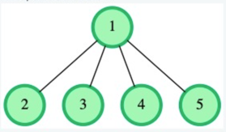
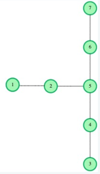

## Link to the problem

> NA: unsolved problem during a certification

##### Difficulty Level (according to HackerRank)

> Medium (Algorithms | Graph Theory )

##### Resume of the problem - Hotel Construction:

There are a certain number of cities in a country, some of which are connected 
with bidirectional roads. The number of roads is one less the number of cities, 
and it is possible to travel between any pair of cities using the roads. 
The distance between cities is the minimum number of roads one has to cross 
when traveling between them. How many ways are there to build exactly 3 hotels, 
each in a different city, such that the distance between every pair of hotels 
is equal?

For example, let's say there are n = 5 cities, and roads = [[1, 2], [1, 3], [1, 4], [1, 5]]. 
This means that city 1 is connected with roads to all other cities, as seen below:



There are 4 ways to build exactly 3 hotels, each in a different city, 
so that the distance&nbsp; between every pair of hotels is equal:

- Build hotels in cities 2, 3 and 4
- Build hotels in cities 2, 3 and 5
- Build hotels in cities 2, 4 and 5
- Build hotels in cities 3, 4 and 5

In all these cases, the distance between every pair of hotels is 2.
Because there are 4 ways to accomplish this, the answer is 4.

### Function Description

Complete the function *numberOfWays*. The function must return an integer denoting the number of ways
to build 3 hotels in such a way that the distance between every pair of hotels is equal.

*numberOfWays* has the following parameter:
int roads[n - 1][2]: a 2-dimensional array of integer, 0-indexed, such that *roads[i][0]* and *roads[i][1]* 
denote cities that are connected by the i^th road.

### Constraints

- 4 =< n =< 50
- 1 =< *roads[i][0]* =< n
- 1 =< *roads[i][1]* =< n
- *roads[i][0]* != *roads[i][1]*

### Sample case 0

#### Sample input for custom testing
```
6
2
1 2
2 5
3 4
4 5
5 6
7 6
```

#### Sample output
```
2
```

#### Explanation

In this case, there are n = 7 cities, n - 1 = 6 and roads = [[1, 2], [2, 5], [3, 4], [4, 5], [5, 6], [7, 6]]. 
This means there are 7 cities connected, as shown below: 



There are 2 ways to build 3 hotels under the conditions:
- Build hotels in cities 2, 4 and 6. The distance between any pair of hotels is 2 in this case.
- Build hotels in cities 1, 3 and 7. The distance between any pair of hotels is 3 in this case.

### Sample case 1

#### Sample input for custom testing
```
4
2
1 2
2 3
3 4
4 5
```

#### Sample output
```
0
```

#### Explanation

In this case, n = 5 and roads = [[1, 2], [2, 3], [3, 4], [4, 5]].
This means there are 5 cities connected to form a single path, as shown below:

In this case, it is impossible to build 3 hotels under the conditions.
Therefore, the answer is 0.

##### Notes


## Final result