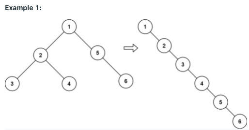

## Link to the problem
 
 - https://leetcode.com/explore/challenge/card/may-leetcoding-challenge-2021/599/week-2-may-8th-may-14th/3742/
 - https://leetcode.com/problems/flatten-binary-tree-to-linked-list/
 
##### Difficulty Level (according to Leetcode)
 
 > Medium (Tree)
 
##### Resume of the problem:



```
Example 1:
Input: root = [1,2,5,3,4,null,6]
Output: [1,null,2,null,3,null,4,null,5,null,6]

Example 2:
Input: root = []
Output: []

Example 3:
Input: root = [0]
Output: [0]
```
 
  